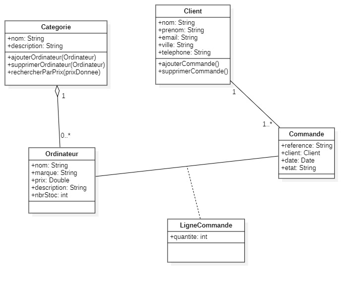

## Travaux Pratiques
## Titre : Héritage, Redéfinition, Polymorphisme, Classes abstraites et interfaces.
- Etudiant : **Oussama KHOUYA**
- Encadrente : **Pr. Loubna AMINOU**
- Cours : **Programmation Orientée Objet Java** 
- Date de soumission : **03-11-2024**
- Code source sur [github](https://github.com/khouya-ai/poo-java)

### EX1 : Gestion des livres et des adhèrents d’une bibliothèque
1. Classe `Personne` : Elle contient les attributs privés pour le nom, prénom, email, téléphone, et âge. Le constructeur initialise ces attributs, et la méthode `afficher()` les affiche.
2. Classe `Adherent` : Hérite de Personne et ajoute l'attribut numAdherent. Elle redéfinit la méthode`afficher()` pour inclure cet attribut.

3. Classe `Auteur` : Similaire à Adherent, elle hérite de Personne, ajoute un attribut numAuteur et redéfinit la méthode `afficher()`.

4. Classe `Livre` : Contient un ISBN, un titre, et un objet Auteur. La méthode `afficher()` affiche ces informations, y compris celles de l'auteur.

5. Classe `Main` : Dans la méthode `main()`, un Adherent, un Auteur, et un Livre sont créés, puis leurs informations sont affichées.
### Code source :
```java
package site.khouya.EX1;

public class Main {
   public static void main(String[] args) {

      // déclarez et intentiez un adhèrent
      Adherent adherent = new Adherent("ALI", "Ahmed", "ahmed.ali@gmail.com", "0987654321", 25, "AD123");


      // déclarez et instanciez un livre qui est écrit par un auteur
      Auteur auteur = new Auteur("Martin", "Robert", "martin.robert@gmail.com", "1234567890", 45, "A001");
      Livre livre1 = new Livre(123, "Clean Code", auteur);


      // affichez les informations de l’adhèrent et du livre.
      System.out.println("*** Informations de l'adherent :");
      adherent.afficher();
      System.out.println();
      System.out.println("*** Informations du livre :");
      livre1.afficher();
   }
}

```

### Exemple de sortie :
```java
*** Informations de l'adherent :
numAdherent: AD123
nom: ALI
prenom: Ahmed
email: ahmed.ali@gmail.com
telephone: 0987654321
age: 25

        *** Informations du livre :
isbn: 123
titre: Clean Code
numAuteur: A001
nom: Martin
prenom: Robert
email: martin.robert@gmail.com
telephone: 1234567890
age: 45
```
---

### EX2 : Calcule de salaire

1. La classe `Employe` est une classe abstraite qui définit les attributs de base et méthodes pour les autres classes (ingénieur et manager) qui hériteront d’elle. 
- La méthode `calculerSalaire()` est définie comme abstraite. Cela signifie que chaque sous-classe (ingénieur et manager) doit fournir sa propre implémentation de cette méthode.
```java
   public abstract double calculerSalaire();
   ```
2. La classe `Ingenieur` hérite de Employe et représente un ingénieur avec une spécialité.
- La méthode `calculerSalaire()` est redéfinie pour calculer le salaire en appliquant une augmentation de 15%.
```java
@Override
public double calculerSalaire() {
   return salaire * 1.15; // Augmentation de 15%
}
   ```
3. La classe `Manager` hérite également de Employe et représente un manager avec un service associé.
   - La méthode `calculerSalaire()` est redéfinie pour calculer le salaire en appliquant une augmentation de 20%.
```java
@Override
public double calculerSalaire() {
   return salaire * 1.2; // Augmentation de 20%
}
   ```
4. Affichage des informations :

```java
// déclarez et intentiez un ingénieur
Ingenieur ingenieur = new Ingenieur("ALI", "Ahmed", "ahmed@gmail.com","06-77-77-77-77",10000,"Securite");
//déclarez et intentiez un manager
Manager manager = new Manager("MOUNIR", "Samira", "samira@gmail.com","06-99-99-99-99",15000,"Service IT");
//affichez les informations de l’ingénieur et du manager
System.out.println("*** Informations de l’ingénieur");
System.out.println(ingenieur);
System.out.println();
System.out.println("*** Informations du manager");
System.out.println(manager);
```
### Exemple de sortie :
```java
*** Informations de l’ingénieur
        specialite='Securite'
nom='ALI'
prenom='Ahmed'
email='ahmed@gmail.com'
telephone='06-77-77-77-77'
salaire=11500.0

*** Informations du manager
service='Service IT'
nom='MOUNIR'
prenom='Samira'
email='samira@gmail.com'
telephone='06-99-99-99-99'
salaire=18000.0
```
---
### EX3 : gestion de commandes pour une entreprise qui vend des ordinateurs
### Diagramme de classes

### L'implémentation de Diagramme de classes 
1. Classe `Ordinateur`:
   - Cette classe possède  des attributs privés pour stocker les informations sur un ordinateur : nom, marque, prix, description, nombreEnStock, et categorie.
   - Méthode `getPrixPourQuantite` : Cette méthode calcule le coût total pour une quantité donnée d'ordinateurs, en multipliant le prix de l'ordinateur par la quantité.
2. Classe `Catégorie` :
   - Cette classe possède les attributs nom, description, et ordinateurs, où ordinateurs est une liste qui contient tous les ordinateurs appartenant à cette catégorie.
   - Méthodes: `ajouterOrdinateur(Ordinateur ordinateur)`, `supprimerOrdinateur(Ordinateur ordinateur)` et `rechercherParPrix(double prix)`
3. Classe `Client` : 
   - Cette classe représente un client avec des attributs comme nom, prenom, adresse, email, ville, telephone, et commandes.
   - Méthodes :`ajouterCommande(Commande commande)` et `supprimerCommande(Commande commande)`
4. Classe `Commande`
   - Cette classe Commande a des attributs pour représenter les informations de commande : reference (référence unique de la commande), client (le client qui a passé la commande), dateCommande, et etatCommande.
5. Classe `LigneCommande`
   - Cette classe représente une ligne de commande spécifique, contenant les informations sur quantite (quantité commandée de l'ordinateur), commande (référence à la commande associée), et ordinateur (l'ordinateur commandé).
### Code source: main()
```java
package site.khouya.EX3;

import java.util.ArrayList;
import java.util.Arrays;
import java.util.Date;
import java.util.List;

public class Main {

   public static void main(String[] args) {
      //déclarez et intentiez une liste de trois ordinateurs
      Ordinateur ord1 = new Ordinateur("Lenovo ThinkCentre M83", "Lenovo", 1280, "Lenovo ThinkCentre M83 Mini Tower Desktop i3 4ème Gènèration", 20);
      Ordinateur ord2 = new Ordinateur("Lenovo T440 i5 4éme gen", "Lenovo", 1700, "Lenovo T440 i5 4éme generation",20);
      Ordinateur ord3 = new Ordinateur("DELL Optiplex 9020 i7", "Dell", 1650, "UNITE CENTRALE DELL Optiplex 9020 i7 - 4790 8go 128g ssd   dsza",20);
      List<Ordinateur> ordinateurList = new ArrayList<>(Arrays.asList(ord1, ord2, ord3));

      //déclarez et intentiez une catégorie
      Categorie categorie1 = new Categorie("Ordinateurs", "Electroniques", ordinateurList);

      //déclarez et intentiez une client
      Client client1 = new Client("ALI", "Mounir", "Massira Mohamadia", "mounir@gmail.com", "Mohamadia", "0123456789");

      // déclarez et instanciez une commande du client
      Commande commande1 = new Commande("123", client1, new Date(), "LIVRAIE");
      // associe la commande 1 au client 1
      client1.ajouterCommande(commande1);

      //déclarez et instanciez une liste de trois lignes de commandes pour la commande et les ordinateurs créés
      LigneCommande ligne1 = new LigneCommande(2,commande1, ord1);
      LigneCommande ligne2 = new LigneCommande(3,commande1, ord2);
      LigneCommande ligne3 = new LigneCommande(1,commande1, ord3);

      //affichez toutes les informations de la commande
      System.out.println();
      System.out.println(commande1.toString());
      System.out.println("\nDetails :");
      System.out.println("Produit \t\t\t\t Prix Unit \t Quantité \t Prix Total");
      System.out.println(ligne1.toString());
      System.out.println(ligne2.toString());
      System.out.println(ligne3.toString());

   }
}

```
### Exemple de sortie :
```java
Commande : 
reference : '123'
client : Client :
	 nom : 'ALI'
	 prenom : 'Mounir'
	 adresse : 'Massira Mohamadia'
	 email : 'mounir@gmail.com'
	 ville : 'Mohamadia'
	 telephone : '0123456789'
date : Sun Nov 03 16:35:40 WEST 2024
etat : 'LIVRAIE'

Details :
Produit 		 Prix Unit 	 Quantité 	 Prix Total
Lenovo ThinkCentre M83	 1280.0		 2		 2560.0
Lenovo T440 i5 4éme gen	 1700.0		 3		 5100.0
DELL Optiplex 9020 i7	 1650.0		 1		 1650.0

```
---
### EX4 : Gestion d'une collection d'objets Produit avec des listes et des interfaces

1. Classe `Produit` représente un produit dans le système, avec les attributs suivants :
   - id : Identifiant unique du produit.
   - nom : Nom du produit.
   - marque : Marque du produit.
   - prix : Prix du produit.
   - description : Description du produit.
   - nombreEnStock : Quantité en stock du produit.
2. Interface `IMetierProduit`
   L'interface IMetierProduit définit les méthodes de base pour gérer les produits dans une liste.
   Les méthodes définies dans cette interface sont :
   `add(Produit p)`, `getAll()`, `findByNom(String motCle)`, `findById(long id)` et `delete(long id)`
```java
package site.khouya.EX4;

import java.util.List;

public interface IMetierProduit {
   public Produit add(Produit p);

   public List<Produit> getAll();

   public List<Produit> findByNom(String motCle);

   public Produit findById(long id);

   public void delete(long id);
}
```
3. Classe `MetierProduitImpl` implémente l'interface `IMetierProduit` et contient une liste de produits pour stocker et gérer les objets de type `Produit`. Elle définit le comportement des méthodes déclarées dans l'interface.
```java
package site.khouya.EX4;

import java.util.ArrayList;
import java.util.List;

public class MetierProduitImpl implements IMetierProduit {
    // Liste de produits
    private List<Produit> produits = new ArrayList<>();

    @Override
    public Produit add(Produit p) {
        produits.add(p);
        return p;
    }

    @Override
    public List<Produit> getAll() {
        return produits;
    }

    @Override
    public List<Produit> findByNom(String motCle) {
        List<Produit> result = new ArrayList<>();
        for (Produit p : produits) {
            if (p.getNom().toLowerCase().contains(motCle.toLowerCase())) {
                result.add(p);
            }
        }
        return result;
    }

    @Override
    public Produit findById(long id) {
        for (Produit p : produits) {
            if (p.getId() == id) {
                return p;
            }
        }
        return null; // Retourne null si le produit n'est pas trouvé
    }

    @Override
    public void delete(long id) {
        produits.removeIf(p -> p.getId() == id);
    }
}

```

### Exemple de sortie main():
```java
***** Menu *****
1. Afficher la liste des produits
2. Rechercher des produits par mot clé
3. Ajouter un nouveau produit dans la liste
4. Récupérer et afficher un produit par ID
5. Supprimer un produit par id
0. Quitter
Choisissez une option: 3
Entrez l'ID du produit: 1
Entrez le nom du produit: iphone 16 pro
Entrez la marque du produit: Apple
Entrez le prix du produit: 999
Entrez la description du produit: un smartphone puissant
Entrez le nombre en stock: 100
Produit ajouté avec succès!
***** Menu *****
1. Afficher la liste des produits
2. Rechercher des produits par mot clé
3. Ajouter un nouveau produit dans la liste
4. Récupérer et afficher un produit par ID
5. Supprimer un produit par id
0. Quitter
Choisissez une option: 1
Liste des produits:
Produit{id=1, nom='iphone 16 pro', marque='Apple', prix=999.0, description='un smartphone puissant', nombreEnStock=100}
***** Menu *****
1. Afficher la liste des produits
2. Rechercher des produits par mot clé
3. Ajouter un nouveau produit dans la liste
4. Récupérer et afficher un produit par ID
5. Supprimer un produit par id
0. Quitter
Choisissez une option: 0
Au revoir!
```