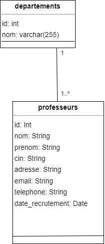
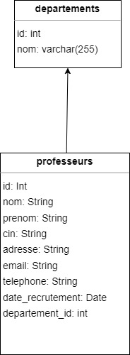
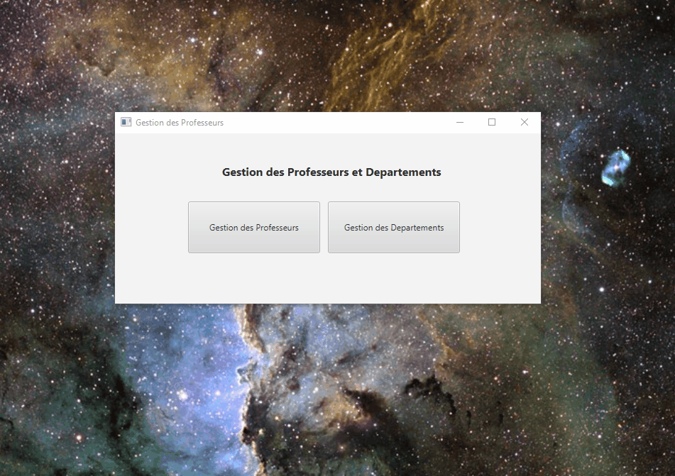
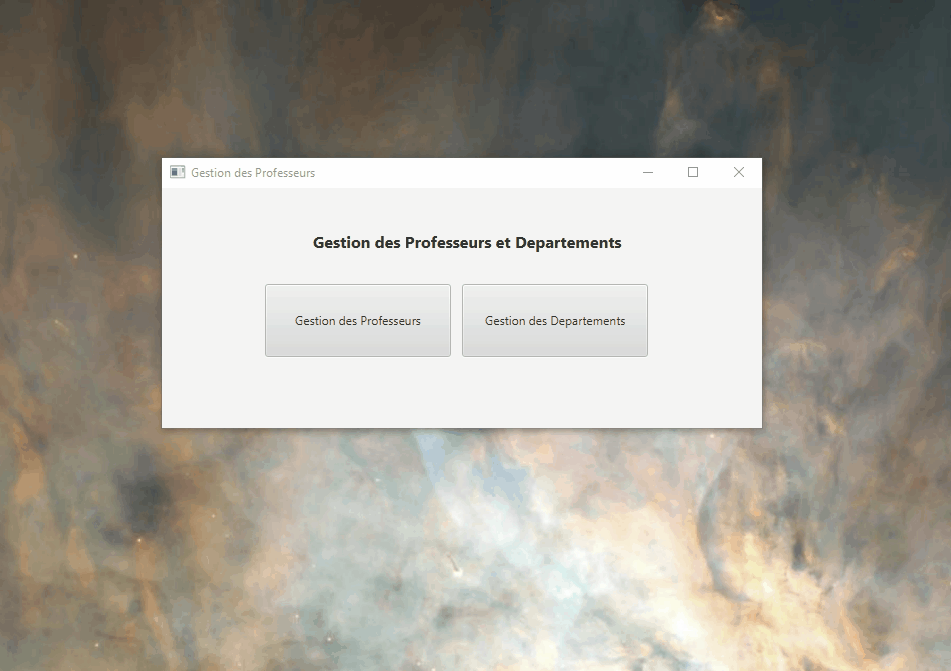

## Travaux Pratiques
## Titre : JavaFX et JDBC
- Etudiant : **Oussama KHOUYA**
- Encadrente : **Pr. Loubna AMINOU**
- Cours : **Programmation Orientée Objet Java** 
- Date de soumission : **01-12-2024**
- Code source sur [github](https://github.com/khouya-ai/poo-java)

L'objectif de ce TP est de créer une application Java afin de gérer les professeurs des départements.
### 1. Etablir la conception de l’application avec un diagramme de classe.

### 2. Etablir le MLD

### 3. Créer la base de données avec les tables dans Mysql.
```sql
create database if not exists javafxdb;

use javafxdb;
CREATE TABLE `departements` (
                                `id` INT(10) NOT NULL AUTO_INCREMENT,
                                `nom` VARCHAR(25) NOT NULL,
                                PRIMARY KEY (`id`),
                                UNIQUE INDEX `nom` (`nom`)
);

CREATE TABLE `professeurs` (
                               `id` INT(10) NOT NULL AUTO_INCREMENT,
                               `nom` VARCHAR(255) NOT NULL,
                               `prenom` VARCHAR(255) NOT NULL,
                               `cin` VARCHAR(10) NOT NULL,
                               `adresse` VARCHAR(255) NOT NULL,
                               `email` VARCHAR(255) NOT NULL,
                               `telephone` VARCHAR(10) NOT NULL,
                               `date_recrutement` DATE NOT NULL,
                               `departement_id` INT(10) NULL DEFAULT NULL,
                               PRIMARY KEY (`id`),
                               UNIQUE INDEX `email` (`email`),
                               UNIQUE INDEX `telephone` (`telephone`),
                               INDEX `professeurs_ibfk_1` (`departement_id`),
                               CONSTRAINT `professeurs_ibfk_1` FOREIGN KEY (`departement_id`) REFERENCES `departements` (`id`) ON UPDATE NO ACTION ON DELETE SET NULL
);
   ```
### 4. Créer les classes persistantes Professeur et Departement.
```java
public class Professeur {
    private int id;
    private String nom;
    private String prenom;
    private String cin;
    private String adresse;
    private String telephone;
    private String email;
    private Date dateRecrutement;
    private int departId;
    private String departNom;
    }
    
public class Departement {
    private int id;
    private String nom;
    }
   ```

### 5. Créer une interface IMetier qui déclare toute les méthodes à implémenter.
```java
public interface IMetier {
void ajouterProfesseur(Professeur p);
void supprimerProfesseur(int id);
void modifierProfesseur(Professeur p);
Professeur rechercherProfesseur(int id);
List<Professeur> listerProfesseurs();
void affecterProfesseurADepartement(int idProf, int idDepart);

    void ajouterDepartement(Departement d);
    void supprimerDepartement(int id);
    void modifierDepartement(Departement d);
    Departement rechercherDepartement(int id);
    List<Departement> listerDepartements();
    List<Professeur> listerProfesseursParDepartement(int idDepart);
}
   ```
### 6. Créer une classe SignletonConnexionDB qui contient une méthode getConnexion, qui retourne une connexion unique vers la base de données.
```java
public class SingletonConnexionDB {
   private static Connection connection;

   private SingletonConnexionDB() {}

   public static Connection getConnexion() {
      if (connection == null) {
         try {
            connection = DriverManager.getConnection("jdbc:mysql://localhost:3306/javafxdb", "root", "");
         } catch (SQLException e) {
            e.printStackTrace();
            System.out.println("Erreur de connexion");
         }
      }
      return connection;
   }
}
```
### 7. Créer une implémentation de l’interface IMetier.
```java

   @Override
   public List<Departement> listerDepartements() {
      List<Departement> departements = new ArrayList<>();
      try {
         String sql = "SELECT * FROM Departements";
         Statement stmt = dbConnection.createStatement();
         ResultSet rs = stmt.executeQuery(sql);
         while (rs.next()) {
            Departement dept = new Departement();
            dept.setId(rs.getInt("id"));
            dept.setNom(rs.getString("nom"));
            departements.add(dept);
         }
      } catch (SQLException e) {
         e.printStackTrace();
      }
      return departements;
   }
    @Override
    public Departement rechercherDepartement(int id) {
        Departement dept = null;
        try {
            String sql = "SELECT * FROM Departements WHERE id = ?";
            PreparedStatement ps = dbConnection.prepareStatement(sql);
            ps.setInt(1, id);
            ResultSet rs = ps.executeQuery();
            if (rs.next()) {
                dept = new Departement();
                dept.setId(rs.getInt("id"));
                dept.setNom(rs.getString("nom"));
            }
        } catch (SQLException e) {
            e.printStackTrace();
        }
        return dept;
    }

    @Override
    public void ajouterDepartement(Departement d) {
       try {
          String sql = "INSERT INTO Departements (nom) VALUES (?)";
          PreparedStatement ps = dbConnection.prepareStatement(sql);
          ps.setString(1, d.getNom());
          ps.executeUpdate();
       } catch (SQLException e) {
          e.printStackTrace();
       }
    }

    @Override
    public void supprimerDepartement(int id) {
       try {
          String sql = "DELETE FROM Departements WHERE id = ?";
          PreparedStatement ps = dbConnection.prepareStatement(sql);
          ps.setInt(1, id);
          ps.executeUpdate();
       } catch (SQLException e) {
          e.printStackTrace();
       }
    }

    @Override
    public void modifierDepartement(Departement d) {
       try {
          String sql = "UPDATE Departements SET nom = ? WHERE id = ?";
          PreparedStatement ps = dbConnection.prepareStatement(sql);
          ps.setString(1, d.getNom());
          ps.setInt(2, d.getId());
          ps.executeUpdate();
       } catch (SQLException e) {
          e.printStackTrace();
       }
    }
   ```
### 8. Créer une application Console pour tester toutes méthodes métier.
```java
public static void main(String[] args) {
        Metier metier = new Metier();
        
        // Ajouter des départements
        Departement d1 = new Departement(0, "Mathematics");
        Departement d2 = new Departement(0, "Computer Science");
        metier.ajouterDepartement(d1);
        metier.ajouterDepartement(d2);

        // Lister les départements
        System.out.println("Départements après l'ajout :");
        List<Departement> departements = metier.listerDepartements();
        departements.forEach(System.out::println);

        // Ajouter des professeurs
        Professeur p1 = new Professeur(0, "Smith", "John", "CIN123", "123 Rue Principale", "0612345678", "john.smith@example.com", new Date(), 0);
        Professeur p2 = new Professeur(0, "Doe", "Jane", "CIN456", "456 Rue de l'Orme", "0612345679", "jane.doe@example.com", new Date(), departements.getFirst().getId());
        metier.ajouterProfesseur(p1);
        metier.ajouterProfesseur(p2);

        // Lister les professeurs
        System.out.println("\nProfesseurs après l'ajout :");
        List<Professeur> professeurs = metier.listerProfesseurs();
        professeurs.forEach(System.out::println);

        // Modifier un professeur
        professeurs.getFirst().setNom("Johnson");
        metier.modifierProfesseur(professeurs.getFirst());

        // Rechercher et afficher le professeur modifié
        Professeur professeurRecherché = metier.rechercherProfesseur(professeurs.getFirst().getId());
        System.out.println("\nProfesseur après la modification :");
        System.out.println(professeurRecherché);

        // Affecter un professeur à un département
        metier.affecterProfesseurADepartement(professeurs.getFirst().getId(), departements.getLast().getId());
        System.out.printf("\nProfesseurs du département %d :\n",departements.getLast().getId());
        List<Professeur> profsDansDepartement = metier.listerProfesseursParDepartement(departements.getLast().getId());
        profsDansDepartement.forEach(System.out::println);

        // Supprimer un département
        System.out.printf("\nSupprimer le département %d :\n",departements.getLast().getId());
        metier.supprimerDepartement(departements.getLast().getId());

        // Supprimer un professeur
        System.out.printf("\nSupprimer le professeur %d :\n",professeurs.getFirst().getId());
        metier.supprimerProfesseur(professeurs.getFirst().getId());

        // Liste finale des professeurs et des départements
        System.out.println("\nListe finale des professeurs :");
        metier.listerProfesseurs().forEach(System.out::println);

        System.out.println("\nListe finale des départements :");
        metier.listerDepartements().forEach(System.out::println);
    }
   ```

### 9. Créer une application Javafx pour faire toutes les opération dans l’interface
- Gestion des Professeurs

- Gestion des Departements

---
